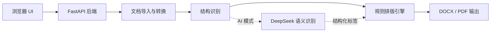

# WordTidy

> 浏览器轻 UI + 后端 Word 排版引擎。上传文档，选择规则，输出规范的 Word 或 PDF。

[](https://github.com/vluckyzhang/WordTidy/releases)
[](LICENSE)
[](backend)
[](frontend)

项目地址：[https://github.com/vluckyzhang/WordTidy](https://github.com/vluckyzhang/WordTidy)

## 项目简介

WordTidy 是一个面向论文、报告、制度文件和批量文档整理场景的 Word 自动排版工具。它采用“浏览器轻 UI + 后端文档排版引擎”的结构，前端负责上传、规则编辑和交互，后端负责解析文档、应用确定性排版规则并输出文件。

第一版版本号为 `0.1`，重点是把核心排版链路跑通，并提供可扩展的规则结构。

## 功能亮点

- 支持 `.docx`、`.doc`、`.txt`、`.md` 输入。
- 支持输出 `.docx` 和 PDF。
- 支持拖拽上传。
- 支持页面、正文、标题、题注、目录、公式、图表、页码等排版规则。
- 标题支持一级到八级；二级到八级可按需移除，一级标题固定保留。
- 支持本机字体懒加载选择，只有点击字体输入框时才读取字体列表。
- 支持字号 pt 与 Word 中文字号切换。
- 支持单倍、1.5 倍、2 倍、多倍、固定值行距。
- 支持三线表、图片居中、图题/表题上移。
- 支持目录、图目录、表目录字段插入。
- 支持公式识别与排版，AI 增强识别仅在 AI 模式下启用。
- 支持 DeepSeek API：AI 只负责内容结构识别，最终格式仍由规则引擎稳定执行。
- 左侧工具区提供版本检查、项目地址、版权信息和赞助作者入口。

## 技术栈

```text
前端：React + TypeScript + Vite
后端：Python + FastAPI
Word 处理：python-docx + lxml + OOXML XML 操作
转换：LibreOffice headless
AI：DeepSeek API
部署：Docker Compose
许可证：MIT
```

## 架构



## 本地运行

### 1. 启动后端

```powershell
cd backend
python -m venv .venv
.\.venv\Scripts\Activate.ps1
pip install -r requirements.txt
uvicorn app.main:app --reload --host 127.0.0.1 --port 8000
```

### 2. 启动前端

```powershell
cd frontend
npm install
npm run dev
```

访问：

```text
http://127.0.0.1:5173
```

## Docker 运行

```powershell
docker compose up --build
```

访问：

```text
http://127.0.0.1:5173
```

## DeepSeek 配置

AI 模式可以通过前端临时填写 API key，也可以在后端设置环境变量：

```powershell
$env:DEEPSEEK_API_KEY="你的 API Key"
$env:DEEPSEEK_MODEL="deepseek-chat"
$env:DEEPSEEK_BASE_URL="https://api.deepseek.com"
```

未配置 API key 时，AI 模式会回退到本地启发式识别。

## LibreOffice 配置

以下能力依赖 LibreOffice：

- `.doc` 转 `.docx`
- `.docx` 转 PDF

如果系统不能直接找到 `soffice`，请设置：

```powershell
$env:LIBREOFFICE_PATH="C:\Program Files\LibreOffice\program\soffice.exe"
```

Docker 镜像内已安装 LibreOffice。

## 默认规则

默认规则覆盖：

- 页面：A4、页边距、页眉页脚距离。
- 正文：中文宋体、英文数字 Times New Roman、固定行距、两端对齐、首行缩进。
- 标题：一级到三级默认开启，四级到八级可添加。
- 题注：图题、表题位于图表上方。
- 目录：目录、图目录、表目录。
- 公式：基础识别与 AI 增强识别。
- 图表：三线表、图片居中。
- 页码：目录罗马数字、正文阿拉伯数字。

示例规则文件：

```text
示例/论文排版预设.json
```

## 目录结构

```text
WordTidy/
  backend/                 FastAPI 后端与 Word 排版引擎
  frontend/                React + Vite 前端
  frontend/public/赞助与社群/ 赞助与交流群二维码资源
  示例/                    排版规则示例
  docker-compose.yml       Docker Compose 配置
  README.md
  LICENSE
  CHANGELOG.md
```

## 当前限制

- Word 目录、图目录、表目录使用字段插入，首次打开文档时需要 Word 或 LibreOffice 更新域。
- 单节文档无法可靠地区分“目录罗马页码”和“正文阿拉伯页码”。如果模板本身已有目录节和正文节，后端会分别设置页码格式；否则会输出提示。
- 复杂浮动图片、嵌套表格、手工绘图对象的视觉结果建议通过 PDF 输出检查。
- 第一版未内置用户账号、任务队列、历史文件管理和数据库。
